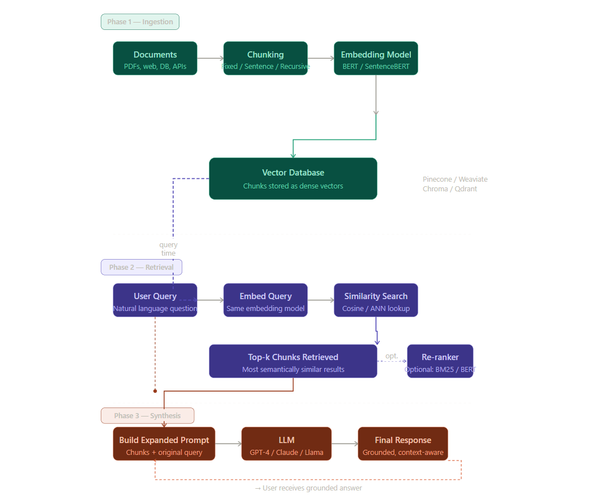

## RAG bASIC ARCHITECTURE


##  The RAG Pipeline — Three Big Phases

```
[INGESTION] → [RETRIEVAL] → [SYNTHESIS/RESPONSE GENERATION]
```

---

## Phase 1: Ingestion

This is the "setup" phase. You process all your documents and store them in a searchable format.

### Step A — Chunking

You can't embed an entire 200-page PDF as one unit — it's too large and too noisy. So you break it into smaller pieces called **chunks**.

**Analogy:** Think of a book. Instead of searching the whole book, you build an index that points to specific paragraphs. Each indexed paragraph = a chunk.

### Chunking Strategies:

**1. Fixed-Size Chunking**
Divide text into equal-sized pieces (e.g., every 256 tokens), with a small overlap between them.

- Overlap is important! It ensures no context is lost at the boundary between two chunks.
- Simple, fast, and computationally cheap.
- Example with LangChain:

```python
from langchain.text_splitter import CharacterTextSplitter
text_splitter = CharacterTextSplitter(
    separator="\n\n",
    chunk_size=256,
    chunk_overlap=20
)
docs = text_splitter.create_documents([text])
```

**2. Context-Aware Chunking**
Instead of arbitrary sizes, you respect the natural structure of text.

- **Naive Splitting** — Split on periods and newlines. Dead simple but misses nuance.
- **NLTK Sentence Tokenizer** — Uses Natural Language Toolkit to detect proper sentence boundaries. Better than naive.
- **spaCy Sentence Segmentation** — Advanced NLP library, handles edge cases well (abbreviations, quotes, etc.).

**3. Recursive Chunking**
Tries multiple separators in sequence (paragraphs → sentences → words) and picks the most balanced split. Best for inconsistently structured documents.

```python
from langchain.text_splitter import RecursiveCharacterTextSplitter
text_splitter = RecursiveCharacterTextSplitter(chunk_size=256, chunk_overlap=20)
docs = text_splitter.create_documents([text])
```

**Golden Rule of Chunking:**

> "If the chunk makes sense to a human without surrounding context, it will make sense to the LLM too."
> 

---

### Step B — Embedding

Once chunked, each piece of text is converted into a **vector** — a list of numbers that captures the *meaning* of the text in a mathematical space.

**Analogy:** Imagine a giant map where similar-meaning texts are placed close to each other. "The dog chased the cat" and "A canine pursued a feline" would be neighbors on this map. A vector is simply the GPS coordinate of a piece of text on this meaning-map.

### Types of Embeddings:

**Sparse Embeddings (e.g., TF-IDF, BM25)**

- Represent text as counts of which words appear
- Great for keyword matching ("find documents containing 'refund policy'")
- Fast, computationally cheap
- Misses semantic meaning — "automobile" and "car" would not be neighbors

**Dense/Semantic Embeddings (e.g., BERT, SentenceBERT)**

- Represent the full *meaning* of text in a compact vector
- "automobile" and "car" are close in the vector space
- Better for questions where the user asks something in different words than what the document uses
- SentenceBERT is the most commonly used for RAG

> To pick the best embedding model for your use case, consult the **HuggingFace MTEB Leaderboard** (Massive Text Embedding Benchmark).
> 

---

### Step C — Storing in a Vector Database

All the embedded chunks are stored in a **vector database**, which is optimized to find the most similar vectors to a query vector extremely fast.

### Types of Databases:

**Vector Database (e.g., Pinecone, Weaviate, Chroma, Qdrant)**

- Stores dense embeddings
- Searches by semantic similarity
- May occasionally retrieve something loosely related but not exactly right

**Graph Database**

- Stores entities and their relationships (e.g., "Apple → CEO → Tim Cook")
- Very precise, but requires exact matching
- Great for structured knowledge

**SQL Database**

- Structured data, good for filters and joins
- Lacks semantic search capability

**Hybrid Approach (Best of Both)**
Index entity relationships extracted from text as vector embeddings inside a graph database. Combines precision with semantic flexibility.

---

## Phase 2: Retrieval

When a user asks a question, the system finds the most relevant chunks from the database.

### The Flow:

1. User's question is embedded using the same model used to embed the documents
2. The vector database finds chunks whose vectors are closest to the question's vector
3. Top-k chunks are returned

**Analogy:** Your question becomes a GPS coordinate. The database finds all the nearest "meaning neighbors" and returns them.

---

### Retrieval Strategy 1 — Standard (Naive) Retrieval

The simplest approach. The same text chunks used for indexing are also used as context for the LLM.

**Pros:** Simple, fast, consistent
**Cons:** LLM may not have enough surrounding context to answer well; small chunks can lack full meaning

---

### Retrieval Strategy 2 — Sentence-Window Retrieval (Small-to-Large Chunking)

A smarter two-step approach:

1. **Index** very small units (individual sentences) for precise matching
2. **Retrieve** those small units when relevant, but **expand** the context by including surrounding sentences before sending to the LLM

**Analogy:** You search using a precise quote from a book (one sentence), but when you read it, you flip back two pages and forward two pages to get the full picture. The LLM gets the wider context.

**Pros:** Precise retrieval + rich context for generation
**Cons:** More complex pipeline; may still miss broader context

---

### Retrieval Strategy 3 — Retriever Ensembling + Reranking

Why pick one chunk size when you can try all of them at once?

**Process:**

1. Chunk the same document at multiple sizes (e.g., 128, 256, 512, 1024 tokens)
2. For a query, retrieve candidates from all chunk sizes
3. Pool all candidates together
4. Use a **re-ranker** to score and prune the final list

**Analogy:** Asking 4 different-sized nets to fish in the same lake, then having an expert judge which fish are most relevant to your recipe.

**Result:** Slightly better faithfulness metrics, but adds cost and complexity.

---

## Re-Ranking

After initial retrieval, a re-ranker re-scores all candidates to select the best ones.

### Types of Re-Ranking:

**Lexical Re-Ranking (BM25, TF-IDF cosine similarity)**

- Checks word-level overlap between query and document
- Fast and cheap
- Doesn't understand meaning

**Semantic Re-Ranking (BERT, Transformer-based)**

- Understands context and meaning
- More accurate but computationally expensive
- Models: monoBERT, duoBERT, ListT5, ListBERT

**Learning-to-Rank (LTR)**

- A model trained specifically to rank documents
- Can use point-wise (rank one doc), pair-wise (which of two is better), or list-wise scoring

**Hybrid Re-Ranking**

- Combines lexical + semantic signals + business rules (e.g., "don't show expired offers")
- Most production systems use this

---

## Phase 3: Response Generation (Synthesis)

The final step: the retrieved chunks + the user's original question are combined into a prompt and sent to the LLM.

### The Expanded Prompt Structure:

```
[System instruction]
[Retrieved Chunk 1]
[Retrieved Chunk 2]
[Retrieved Chunk 3]
[User's original question]
→ LLM generates the answer
```

### Key Insight — Placement Matters

Based on the "Lost in the Middle" research, the most important context should be placed at the **beginning or end** of the prompt, never buried in the middle.

**Analogy:** If you're briefing a manager before a meeting, don't bury the most important point in slide 15 of 30. Put it on slide 1 or save it for the final summary.

---

## 5. Complete RAG Summary — Step by Step
INGESTION (done once / periodically):
Documents → Chunking → Embedding → Store in Vector DB

QUERY TIME (every user request):
User Query
   ↓
Embed the query
   ↓
Similarity search in Vector DB → Top-k chunks
   ↓
(Optional) Re-rank chunks
   ↓
Build expanded prompt: [chunks + query]
   ↓
LLM generates final answer
   ↓
User sees response